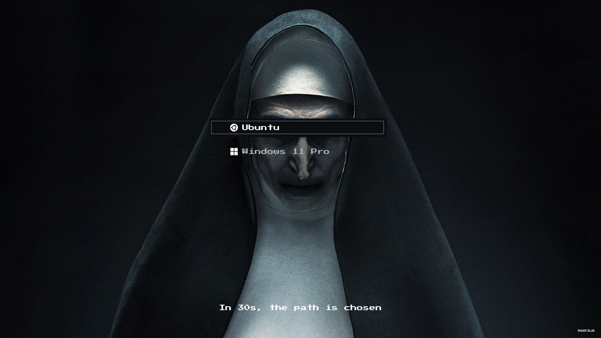

## The Nun Preview



---

## 📥 Installation Instructions
**Step 1: Clone the theme repo**
```bash
git clone https://github.com/hashirsajid58200p/the-nun-grub-theme.git
```

**Step 2: Go inside the theme folder**
```bash
cd the-nun-grub-theme
```

**Step 3: Make the installer script executable**
```bash
chmod +x install.sh
```

**Step 4: Run the installer script**
```bash
sudo ./install.sh
```
Select display resolution:  
1) Full HD (1920x1080)  
2) 2K (2560x1440)  
3) 4K (3840x2160)  
Enter choice [1-3]:

**Step 5: Update GRUB so it applies the theme**
```bash
sudo update-grub
```

---

## 💖 Support & Follow
If you like **The Nun**, consider giving this repo a ⭐ on GitHub.  
You can also follow me for more GRUB themes and Linux customizations:  
[GitHub Profile](https://github.com/hashirsajid58200p)
